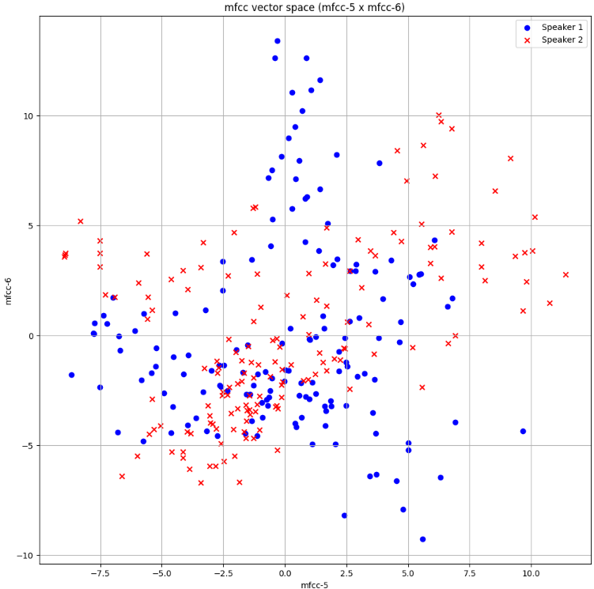
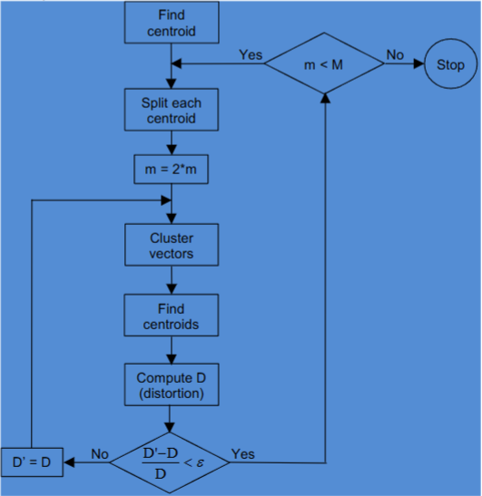
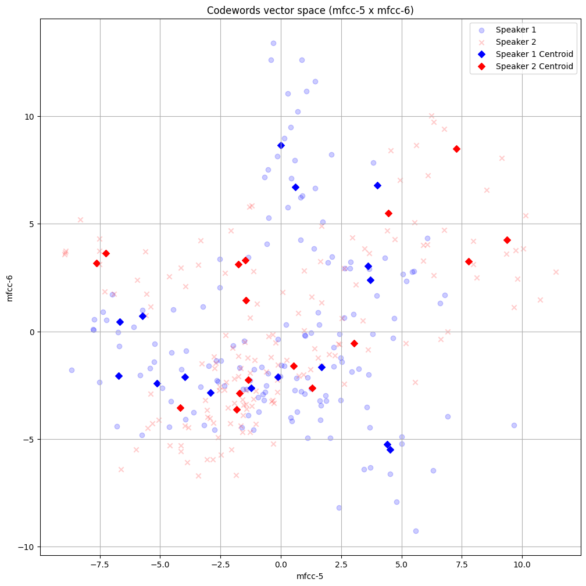

# Speaker_Recognition_EEC_201_Project

Team Job Hunters: Nathan Lai and Anthony Tan-Andia

## Executing the program
1) Download "Speech Recognition Project.ipynb" from the Github respository.
2) Upload the file to a Google Drive and open it in Google Colab
3) Click Runtime>Disconnect and delete runtime>Yes
4) Click Runtime>Run all to run the program

## Abstract
The goal of this project is to create a signal processing model that successfully
identifies speakers using the mel-frequency cepstrum coefficients and vector
quantization. The model is trained on various human voices. These voices are then
treated as signals that are processed and framed using a hamming window. The STFT of
each frame is calculated, and we apply mel-frequency wrapping. From this, we can
caculate the mel-frequency cepstrum coefficients (mfcc) for each frame.
These coefficients are then treated as vectors that can be quantized to recognize
patterns. We apply the LGB algorithm to create centroids from various clusters
in the vector space. These centroids create a collection of codewords in a codebook
which we can use to identify the speaker. To test our model we initially used 11
audio files of different people saying the word "zero". In training, we achieved
an accuracy of 100% and in testing, we achieved an accuracy of 75%. We then went
on to test other features, such as the model's robustness to missing frequencies,
how it handled more speakers, and how it handled more words. 

## Human Benchmark
In our human benchmark, we achieved an accuracy of 37.5%. The speakers that we 
got correct in our initial training set were speakers 2, 3, and 5. Our accuracy
was pretty low as we had trouble remembering what each person sounded like. Some
people sounded very similar to each other while others sounded vastly different.
As a human, picking up these vocal differences during the first pass is difficult.

## Speech Processing

## Vector Quantization
Now that we have the mfccs that represent the features for each speaker, the 
next step is to apply feature matching to identify the speakers. In this
project, we applied Vector Quantization, which is a simple process of mapping
regions in a vector space to specific centroids. Each region is called a cluster
and each cluster's center is a centroid, also known as a codeword. The
collection of codewords for each speaker is the codebook for the speaker. These
codebooks are then used to identify if a test speaker's mfcc is close to a speaker's
codebook to identify the speaker.

First, to verify that the mfcc vectors for a speaker display various clusters that
represent different vocal features, we plotted the mfcc vectors in the 5th and 
6th dimensions for speakers 1 and 2. In Figure B1, we noticed that even by only
plotting 2 dimensions of the mfcc vector, both speaker 1 and speaker 2 had
different clusters in the mfcc vector space. This confirms that the vector
quantization method would work because we would be able to identify different
centroids for each cluster.

|   |
|:--:| 
| *Figure B1: mfcc vector space in the 5th and 6th mfcc dimensions for s1.wav and s2.wav* |

The next step in vector quantization would be to identify the centroids for 
each cluster. This was done by applying the Linde, Buzo, and Gray (LBG)
algorithm to the mfcc vectors. This algorithm is a recursive algorithm that teaches
the clustering of a set of L training vectors into a set of M codewords. The
algorithm is shown in Figure B2. The two hyperparameters that we can tune are 
M - the number of codewords, and epsilon e - the splitting parameter. After, 
running the LBG algorithm on the same speakers - speaker 1 and speaker 2 with 16 
centroids, in Figure B3 we can see that the algorithm successfully plots 16 
centroids for each speaker that correctly maps out the speaker's clusters.

|   |
|:--:| 
| *Figure B2: LBG Algorithm* |

|   |
|:--:| 
| *Figure B3: Centroids on s1.wav and s2.wav vector space in the 5th and 6th mfcc dimenstions* |

After creating a codebook for each speaker in the training set using the LBG
algorithm, the next step is to identify the speakers in the test set. This is done
by first finding the mfccs for the test speaker, then for each test speaker, 
go through all the codebooks, and calculate the average distance between the test 
speaker's mfccs and the codebook's centroids. The codebook that has the smallest
average distance between the mfcc vectors and the codebook's centroids is the best 
match. This is because the clusters would closely match the trained speaker's mfcc
clusters, therefore, their features would match.

## Test Results
### **Test 7**
#### **Non speaker recordings of "zero"**
Training Data Accuracy: 100%
Testing Data Accuracy: 87.5%

#### **Non speaker with teammates' recordings of "zero"**
Training Data Accuracy: 100%
Testing Data Accuracy: 80%

With an accuracy of 87.5% in the speakers without the teammate's recordings,
our model performs drastically better than our human benchmark. Our model only
misidentifies speaker 3 as speaker 5. When listening back at the 2 sound files,
the voices don't sound similar, but the way they emphasize the 'z' and 'o'
is similar. So it's understandable how the model could have mixed those 2 sound
files since they would share a similar feature set.

For the second part of test 7 with the inclusion of the teammate's recordings,
it again misidentifies speaker 3 as speaker 5, but it also misidentifies speaker
8 as speaker Anthony. The decrease in accuracy makes sense because it got the same
speaker wrong, plus one more. With these tests we have identified that the model
specifically has trouble with identifying speaker 3 correctly.

### **Test 8**
#### **Notch filter blocking 60 Hz applied to Test 7**
Testing Data Accuracy: 75%

#### **Notch filter blocking 200 Hz applied to Test 7**
Testing Data Accuracy: 62.5%

#### **Notch filter blocking 400 Hz applied to Test 7**
Testing Data Accuracy: 75%

To test the robustness of our model we added notch filters at 3 different places,
60Hz, 200Hz, and 400Hz. We chose these frequencies based on the fact that
the average frequency spoken by an adult man ranges from 80Hz-180Hz while for women
the average frequency ranges from 165Hz-255Hz. We noticed that the 60Hz and 400Hz
notches, which are outside of that range, give 75%. Both predicting speakers 3 
and 8 wrong, which is consistent with our results in test 7. However, when 
applying the 200Hz notch filter, which is in the vocal ranges, the accuracy 
decreases, predicting speakers 3 and 8 as well as speaker 1 wrong. This makes 
sense because removing a frequency used in everyday speech should make it hard 
for the model to identify speakers. However, our model does pretty well still 
considering that it consistently gets speakers 3 and 8 wrong while the rest can 
be identified accurately except for speaker 1.

### **Test 9**
#### **Original Speakers + 10 random Students with speech "zero"**
Training Data Accuracy: 100%
Testing Data Accuracy: 83.33%

### **Test 10a: Zero/Twelve system**
#### **Train and test with zero**
Training Data Accuracy: 100%
Testing Data Accuracy: 77.77%

#### **Train and test with twelve**
Training Data Accuracy: 100%
Testing Data Accuracy: 72.22%

#### **Train and test with zero/twelve**
Training Data Accuracy: 100%
Testing Data Accuracy: 75%

### **Test 10b: Five/Eleven system**
#### **Train and test with five**
Training Data Accuracy: 100%
Testing Data Accuracy: 100%

#### **Train and test with eleven**
Training Data Accuracy: 100%
Testing Data Accuracy: 86.96%

#### **Train and test with five/eleven**
Training Data Accuracy: 100%
Testing Data Accuracy: 93.48%
